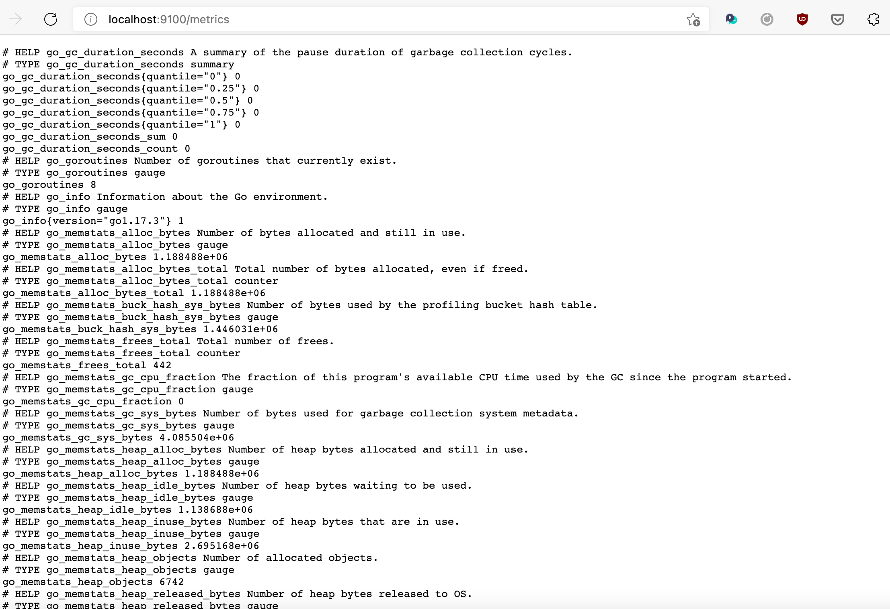
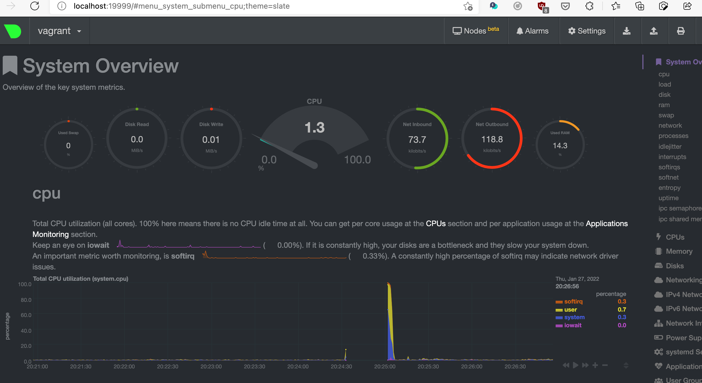

## Задание 1

Конфигурация сервиса node exporter

    $ cat /opt/node_exporter/node_exporter.service
    [Unit]
    Description=Node exporter
    
    [Service]
    Restart=always
    User=vagrant
    EnvironmentFile=/opt/node_exporter/node_exporter.conf
    ExecStart=/usr/bin/node_exporter $ARGS
    ExecReload=/bin/kill -HUP $MAINPID
    ExecStop=/bin/kill -TERM $MAINPID
    TimeoutStopSec=20s
    SendSIGKILL=no
    
    [Install]
    WantedBy=multi-user.target

Файл конфигурации node exporter

    $ cat /opt/node_exporter/node_exporter.conf
    ARGS="--log.level=warn"

Установка node exporter в systemd

    $ sudo systemctl link /opt/node_exporter/node_exporter.service
    Created symlink /etc/systemd/system/node_exporter.service → /opt/node_exporter/node_exporter.service.

Включение node exporter

    $ sudo systemctl enable node_exporter.service
    Created symlink /etc/systemd/system/multi-user.target.wants/node_exporter.service → /opt/node_exporter/node_exporter.service.

Проверка статуса

    $ sudo systemctl status node_exporter.service
    ● node_exporter.service - Node exporter
         Loaded: loaded (/etc/systemd/system/node_exporter.service; enabled; vendor preset: enabled)
         Active: inactive (dead)

Запуск

    $ sudo systemctl start node_exporter.service
    $ sudo systemctl status node_exporter.service
    ● node_exporter.service - Node exporter
         Loaded: loaded (/etc/systemd/system/node_exporter.service; enabled; vendor preset: enabled)
         Active: active (running) since Wed 2022-01-26 14:33:55 UTC; 10s ago
       Main PID: 11442 (node_exporter)
          Tasks: 5 (limit: 1659)
         Memory: 2.8M
         CGroup: /system.slice/node_exporter.service
                 └─11442 /opt/node_exporter/node_exporter
    
    Jan 26 14:33:55 vagrant node_exporter[11442]: ts=2022-01-26T14:33:55.462Z caller=node_exporter.go:115 level=info collector=thermal_zone
    Jan 26 14:33:55 vagrant node_exporter[11442]: ts=2022-01-26T14:33:55.462Z caller=node_exporter.go:115 level=info collector=time
    Jan 26 14:33:55 vagrant node_exporter[11442]: ts=2022-01-26T14:33:55.462Z caller=node_exporter.go:115 level=info collector=timex
    Jan 26 14:33:55 vagrant node_exporter[11442]: ts=2022-01-26T14:33:55.462Z caller=node_exporter.go:115 level=info collector=udp_queues
    Jan 26 14:33:55 vagrant node_exporter[11442]: ts=2022-01-26T14:33:55.462Z caller=node_exporter.go:115 level=info collector=uname
    Jan 26 14:33:55 vagrant node_exporter[11442]: ts=2022-01-26T14:33:55.462Z caller=node_exporter.go:115 level=info collector=vmstat
    Jan 26 14:33:55 vagrant node_exporter[11442]: ts=2022-01-26T14:33:55.462Z caller=node_exporter.go:115 level=info collector=xfs
    Jan 26 14:33:55 vagrant node_exporter[11442]: ts=2022-01-26T14:33:55.463Z caller=node_exporter.go:115 level=info collector=zfs
    Jan 26 14:33:55 vagrant node_exporter[11442]: ts=2022-01-26T14:33:55.463Z caller=node_exporter.go:199 level=info msg="Listening on" address=:9100
    Jan 26 14:33:55 vagrant node_exporter[11442]: ts=2022-01-26T14:33:55.463Z caller=tls_config.go:195 level=info msg="TLS is disabled." http2=false

    $ ps -ef|grep node
    vagrant    11537       1  0 14:33 ?        00:00:00 /opt/node_exporter/node_exporter --log.level=warn

Остановка

    $ sudo systemctl stop node_exporter.service
    $ sudo systemctl status node_exporter.service
    ● node_exporter.service - Node exporter
         Loaded: loaded (/etc/systemd/system/node_exporter.service; enabled; vendor preset: enabled)
         Active: inactive (dead) since Wed 2022-01-26 14:37:01 UTC; 2s ago
        Process: 11490 ExecStart=/opt/node_exporter/node_exporter $ARGS (code=killed, signal=TERM)
        Process: 11512 ExecStop=/bin/kill -TERM $MAINPID (code=exited, status=0/SUCCESS)
       Main PID: 11490 (code=killed, signal=TERM)
    
    Jan 26 14:36:41 vagrant systemd[1]: Started Node exporter.
    Jan 26 14:37:01 vagrant systemd[1]: Stopping Node exporter...
    Jan 26 14:37:01 vagrant systemd[1]: node_exporter.service: Succeeded.
    Jan 26 14:37:01 vagrant systemd[1]: Stopped Node exporter.

Перезагрузка ВМ

    $ sudo reboot
    Connection to 127.0.0.1 closed by remote host.
    Connection to 127.0.0.1 closed.
    macbook0P0LYWK:ubunta kmankov$ vagrant ssh
    Welcome to Ubuntu 20.04.3 LTS (GNU/Linux 5.4.0-91-generic x86_64)
      System information as of Wed 26 Jan 2022 02:41:23 PM UTC

      System load:  0.57               Processes:             144
      Usage of /:   12.7% of 30.88GB   Users logged in:       0
      Memory usage: 16%                IPv4 address for eth0: 10.0.2.15
      Swap usage:   0%

    Last login: Sun Jan 23 07:58:26 2022 from 10.0.2.2

    $ ps -ef|grep node
    vagrant      654       1  0 14:41 ?        00:00:00 /opt/node_exporter/node_exporter --log.level=warn
    vagrant     1340    1319  0 14:41 pts/0    00:00:00 grep --color=auto node

    $ sudo systemctl status node_exporter.service
    ● node_exporter.service - Node exporter
         Loaded: loaded (/etc/systemd/system/node_exporter.service; enabled; vendor preset: enabled)
         Active: active (running) since Sun 2022-01-23 18:23:02 UTC; 2 days ago
       Main PID: 654 (node_exporter)
          Tasks: 5 (limit: 1659)
         Memory: 13.9M
         CGroup: /system.slice/node_exporter.service
                 └─654 /opt/node_exporter/node_exporter --log.level=warn
    
    Jan 23 18:23:02 vagrant systemd[1]: Started Node exporter.

## Задание 2

Включенных по умолчанию коллекторов довольно много, они охватывают практически все статистики ОС. 
Отключены по умолчанию те коллекторы, которые довольно тяжелы для повседневного использования.

Для базового мониторинга хоста по CPU, памяти, диску и сети:

    --collector.cpu           Exposes CPU statistics
    --collector.meminfo       Exposes memory statistics.
    --collector.diskstats     Exposes disk I/O statistics.
    --collector.netstat       Exposes network statistics from /proc/net/netstat

    $ cat node_exporter.conf
    ARGS="
    --collector.disable-defaults
    --collector.cpu
    --collector.diskstats
    --collector.netstat
    --collector.meminfo
    --log.level=warn
    "

## Задание 3

    vagrant@vagrant:~$ grep -v '^#' /etc/netdata/netdata.conf
    [global]
        run as user = netdata
        web files owner = root
        web files group = root
        # Netdata is not designed to be exposed to potentially hostile
        # networks. See https://github.com/netdata/netdata/issues/164
        # bind socket to IP = 127.0.0.1
        bind socket to IP = 0.0.0.0

    vagrant@vagrant:~$ ps -ef|grep netdata
    netdata      652       1  2 13:03 ?        00:00:11 /usr/sbin/netdata -D
    netdata      838     652  0 13:03 ?        00:00:00 /usr/lib/netdata/plugins.d/nfacct.plugin 1
    netdata      855     652  0 13:03 ?        00:00:00 bash /usr/lib/netdata/plugins.d/tc-qos-helper.sh 1
    netdata      873     652  1 13:03 ?        00:00:06 /usr/lib/netdata/plugins.d/apps.plugin 1
    netdata      884     652  0 13:03 ?        00:00:02 /usr/bin/python3 /usr/lib/netdata/plugins.d/python.d.plugin 1
    vagrant     1578    1487  0 13:12 pts/0    00:00:00 grep --color=auto netdata

    vagrant@vagrant:~$ sudo systemctl list-units | grep netdata
      netdata.service                                                                           loaded active running   netdata - Real-time performance monitoring

    vagrant@vagrant:~$ sudo systemctl status netdata
    ● netdata.service - netdata - Real-time performance monitoring
         Loaded: loaded (/lib/systemd/system/netdata.service; enabled; vendor preset: enabled)
         Active: active (running) since Thu 2022-01-27 13:03:27 UTC; 10min ago
           Docs: man:netdata
                 file:///usr/share/doc/netdata/html/index.html
                 https://github.com/netdata/netdata
       Main PID: 652 (netdata)
          Tasks: 26 (limit: 1659)
         Memory: 83.8M
         CGroup: /system.slice/netdata.service
                 ├─652 /usr/sbin/netdata -D
                 ├─838 /usr/lib/netdata/plugins.d/nfacct.plugin 1
                 ├─855 bash /usr/lib/netdata/plugins.d/tc-qos-helper.sh 1
                 ├─873 /usr/lib/netdata/plugins.d/apps.plugin 1
                 └─884 /usr/bin/python3 /usr/lib/netdata/plugins.d/python.d.plugin 1
    
    Jan 27 13:03:27 vagrant systemd[1]: Started netdata - Real-time performance monitoring.

Netdata предоставляет широкий спектр метрик производительности ОС в разных разрезах и агрегаций.

## Задание 4
Да, можно. ОС понимает, что загружается в виртуальной среде

    vagrant@vagrant:~$ sudo dmesg | grep virtual
    [    0.002171] CPU MTRRs all blank - virtualized system.
    [    0.148082] Booting paravirtualized kernel on KVM
    [    6.060302] systemd[1]: Detected virtualization oracle.

## Задание 5
/proc/sys/fs/nr_open (since Linux 2.6.25) - ограничение на количество открытых файловых дескрипторов  
` This file imposes ceiling on the value to which the RLIMIT_NOFILE resource limit can be raised (see getrlimit(2)).  This ceiling is enforced for  both
 unprivileged  and  privileged process.  The default value in this file is 1048576.  (Before Linux 2.6.25, the ceiling for RLIMIT_NOFILE was hard-coded
 to the same value.)`

Настройка по умолчанию

    vagrant@vagrant:~$ grep fs.nr_open /etc/sysctl.conf
    vagrant@vagrant:~$ cat /proc/sys/fs/nr_open
    1048576

ulimit --help  

    Modify shell resource limits.

    Provides control over the resources available to the shell and processes
    it creates, on systems that allow such control.

    Options:
    -n	the maximum number of open file descriptors

Установлено ограничение в 1024 открытых файлов для пользователя vagrant 

    vagrant@vagrant:~$ ulimit -n
    1024

## Задание 6

    vagrant@vagrant:~$ sudo -i
    root@vagrant:~# unshare -f --pid --mount-proc sleep 1h

    root@vagrant:~# ps axjf | grep sleep
      22325   22341   22341    1606 pts/0      22341 S+       0   0:00  |                   \_ unshare -f --pid --mount-proc sleep 1h
      22341   22342   22341    1606 pts/0      22341 S+       0   0:00  |                       \_ sleep 1h
      22344   22394   22393    1843 pts/1      22393 S+       0   0:00                      \_ grep --color=auto sleep

    root@vagrant:~# nsenter --target 22342 --pid --mount
    root@vagrant:/# ps aux
    USER         PID %CPU %MEM    VSZ   RSS TTY      STAT START   TIME COMMAND
    root           1  0.0  0.0   7228   592 pts/0    S+   14:40   0:00 sleep 1h
    root           2  0.2  0.2   8960  4136 pts/1    S    14:43   0:00 -bash
    root          13  0.0  0.2  10616  3308 pts/1    R+   14:43   0:00 ps aux

## Задание 7
`:(){ :|:& };:` - Это функция с именем ":", которая ссылается сама на себя рекурсивно и запускает еще две копии себя

   `:() {
      : | : &
   }
   :`

$ :(){ :|:& };:

При попытке выполнить какую-либо команду выводится

    -bash: fork: retry: Resource temporarily unavailable
    -bash: fork: Resource temporarily unavailable
    -bash: fork: Resource temporarily unavailable
    -bash: fork: retry: Resource temporarily unavailable
    -bash: fork: Resource temporarily unavailable
    -bash: fork: Resource temporarily unavailable
    -bash: fork: Resource temporarily unavailable
    -bash: fork: Resource temporarily unavailable
    -bash: fork: retry: Resource temporarily unavailable
    -bash: fork: retry: Resource temporarily unavailable
    -bash: fork: retry: Resource temporarily unavailable
    -bash: fork: retry: Resource temporarily unavailable
    -bash: fork: Resource temporarily unavailable
    -bash: fork: Resource temporarily unavailable

$ sudo dmesg

    [ 1612.469152] cgroup: fork rejected by pids controller in /user.slice/user-1000.slice/session-3.scope
    [ 1621.243968] cgroup: fork rejected by pids controller in /user.slice/user-1000.slice/session-7.scope

Судя по всему механизм CGroup ограничил создание процессов с помощью pids controller

ulimit -u	the maximum number of user processes

Есть ограничение на количество запущенных процессов для пользователя

    vagrant@vagrant:~$ ulimit -u
    5532

