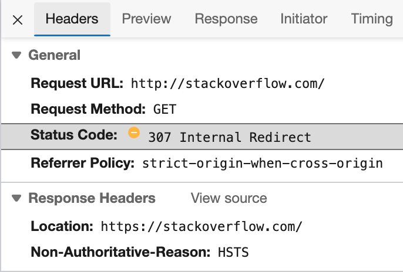
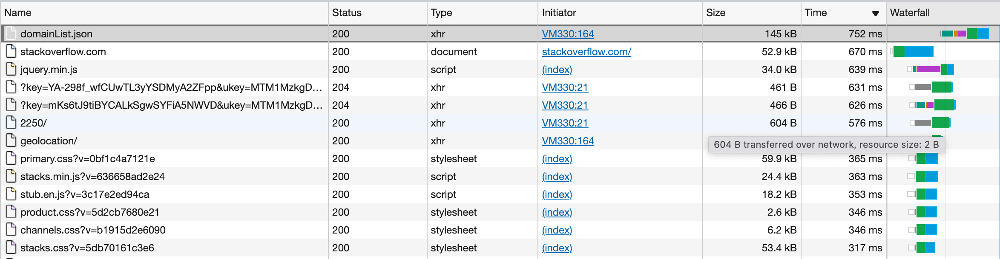

# Домашнее задание к занятию "3.6. Компьютерные сети, лекция 1"

## Задание 1. 
Работа c HTTP через телнет.
- Подключитесь утилитой телнет к сайту stackoverflow.com
`telnet stackoverflow.com 80`
- отправьте HTTP запрос
```bash
GET /questions HTTP/1.0
HOST: stackoverflow.com
[press enter]
[press enter]
```
- В ответе укажите полученный HTTP код, что он означает?

```HTTP/1.1 301 Moved Permanently``` - код 301 - перенаправление

Выполнен редирект на протокол с шифрацией https

```location: https://stackoverflow.com/questions```


## Задание 2. 
Повторите задание 1 в браузере, используя консоль разработчика F12.
- откройте вкладку `Network`
- отправьте запрос http://stackoverflow.com
- найдите первый ответ HTTP сервера, откройте вкладку `Headers`
- укажите в ответе полученный HTTP код.
- проверьте время загрузки страницы, какой запрос обрабатывался дольше всего?
- приложите скриншот консоли браузера в ответ.

код 307 - перенаправление  
  

Дольше всего скачивался json DomainList.json  
  


## Задание 3. 
Какой IP адрес у вас в интернете?


## Задание 4. 
Какому провайдеру принадлежит ваш IP адрес? Какой автономной системе AS? Воспользуйтесь утилитой `whois`
Провайдер Yota  


AS - AS31205

```shell
root@vagrant:~# whois 188.162.14.93 
...
inetnum:        188.162.0.0 - 188.162.15.255
netname:        Yota
...
descr:          NSK SCARTEL network
origin:         AS31205
...
```

## Задание 5. 
Через какие сети проходит пакет, отправленный с вашего компьютера на адрес 8.8.8.8? Через какие AS? Воспользуйтесь утилитой `traceroute`

Видимо провайдер или роутер не пропускает ICMP пакеты  

```shell
vagrant@vagrant:~$ traceroute -An 8.8.8.8
traceroute to 8.8.8.8 (8.8.8.8), 30 hops max, 60 byte packets
 1  10.0.2.2 [*]  0.293 ms  0.242 ms  0.435 ms
 2  192.168.1.1 [*]  5.618 ms  5.771 ms  5.815 ms
 3  * * *
 4  * * *
 5  * * *
 6  * * *
 7  * * *
 8  * * *
 9  * * *
10  * * *
11  * * *
12  * * *
13  * * *
14  * * *
15  * * *
16  * * *
17  * * *
18  * * *
19  * * *
20  * * *
21  * * *
22  * * *
23  * * *
24  * * *
25  * * *
26  * * *
27  * * *
28  * * *
29  * * *
30  * * *
```

## Задание 6. 
Повторите задание 5 в утилите `mtr`. На каком участке наибольшая задержка - delay?

Видимо провайдер или роутер не пропускает ICMP пакеты  

```shell
                                                                     My traceroute  [v0.93]
vagrant (10.0.2.15)                                                                                                                     2022-02-08T15:27:51+0000
Keys:  Help   Display mode   Restart statistics   Order of fields   quit
                                                                                                                        Packets               Pings
 Host                                                                                                                 Loss%   Snt   Last   Avg  Best  Wrst StDev
 1. AS???    10.0.2.2                                                                                                  0.0%    19    0.6   1.3   0.2  12.2   2.7
 2. AS???    192.168.1.1                                                                                               0.0%    19    2.6   3.1   2.1   8.1   1.8
 3. (waiting for reply)
```

## Задание 7. 
Какие DNS сервера отвечают за доменное имя dns.google? Какие A записи? Воспользуйтесь утилитой `dig`

```shell
dns.google.		424	IN	A	8.8.8.8
dns.google.		424	IN	A	8.8.4.4
```

```shell
vagrant@vagrant:~$ dig dns.google

; <<>> DiG 9.16.1-Ubuntu <<>> dns.google
;; global options: +cmd
;; Got answer:
;; ->>HEADER<<- opcode: QUERY, status: NOERROR, id: 20874
;; flags: qr rd ra; QUERY: 1, ANSWER: 2, AUTHORITY: 0, ADDITIONAL: 1

;; OPT PSEUDOSECTION:
; EDNS: version: 0, flags:; udp: 65494
;; QUESTION SECTION:
;dns.google.			IN	A

;; ANSWER SECTION:
dns.google.		424	IN	A	8.8.8.8
dns.google.		424	IN	A	8.8.4.4

;; Query time: 40 msec
;; SERVER: 127.0.0.53#53(127.0.0.53)
;; WHEN: Tue Feb 08 15:43:38 UTC 2022
;; MSG SIZE  rcvd: 71
```

С опциями не получается выполнить запросы к ДНС, видимо провайдер блокирует запросы к сторонним днс.

```shell
vagrant@vagrant:~$ dig +trace @8.8.8.8 dns.google

; <<>> DiG 9.16.1-Ubuntu <<>> +trace @8.8.8.8 dns.google
; (1 server found)
;; global options: +cmd
;; connection timed out; no servers could be reached
```

```shell
vagrant@vagrant:~$ dig +trace dns.google

; <<>> DiG 9.16.1-Ubuntu <<>> +trace dns.google
;; global options: +cmd
.			750	IN	NS	l.root-servers.net.
.			750	IN	NS	a.root-servers.net.
.			750	IN	NS	j.root-servers.net.
.			750	IN	NS	f.root-servers.net.
.			750	IN	NS	c.root-servers.net.
.			750	IN	NS	b.root-servers.net.
.			750	IN	NS	h.root-servers.net.
.			750	IN	NS	g.root-servers.net.
.			750	IN	NS	e.root-servers.net.
.			750	IN	NS	i.root-servers.net.
.			750	IN	NS	d.root-servers.net.
.			750	IN	NS	k.root-servers.net.
.			750	IN	NS	m.root-servers.net.
;; Received 262 bytes from 127.0.0.53#53(127.0.0.53) in 0 ms

;; connection timed out; no servers could be reached

```

## Задание 8. 
Проверьте PTR записи для IP адресов из задания 7. Какое доменное имя привязано к IP? Воспользуйтесь утилитой `dig`

`8.8.8.8.in-addr.arpa.	6190	IN	PTR	dns.google.`
`4.4.8.8.in-addr.arpa.	4699	IN	PTR	dns.google.`

```shell
vagrant@vagrant:~$ dig -x 8.8.8.8

; <<>> DiG 9.16.1-Ubuntu <<>> -x 8.8.8.8
;; global options: +cmd
;; Got answer:
;; ->>HEADER<<- opcode: QUERY, status: NOERROR, id: 45121
;; flags: qr rd ra; QUERY: 1, ANSWER: 1, AUTHORITY: 0, ADDITIONAL: 1

;; OPT PSEUDOSECTION:
; EDNS: version: 0, flags:; udp: 65494
;; QUESTION SECTION:
;8.8.8.8.in-addr.arpa.		IN	PTR

;; ANSWER SECTION:
8.8.8.8.in-addr.arpa.	6190	IN	PTR	dns.google.

;; Query time: 67 msec
;; SERVER: 127.0.0.53#53(127.0.0.53)
;; WHEN: Tue Feb 08 16:11:08 UTC 2022
;; MSG SIZE  rcvd: 73
```
```shell
vagrant@vagrant:~$ dig -x 8.8.4.4

; <<>> DiG 9.16.1-Ubuntu <<>> -x 8.8.4.4
;; global options: +cmd
;; Got answer:
;; ->>HEADER<<- opcode: QUERY, status: NOERROR, id: 48744
;; flags: qr rd ra; QUERY: 1, ANSWER: 1, AUTHORITY: 0, ADDITIONAL: 1

;; OPT PSEUDOSECTION:
; EDNS: version: 0, flags:; udp: 65494
;; QUESTION SECTION:
;4.4.8.8.in-addr.arpa.		IN	PTR

;; ANSWER SECTION:
4.4.8.8.in-addr.arpa.	4699	IN	PTR	dns.google.

;; Query time: 43 msec
;; SERVER: 127.0.0.53#53(127.0.0.53)
;; WHEN: Tue Feb 08 16:12:23 UTC 2022
;; MSG SIZE  rcvd: 73
```

---

В качестве ответов на вопросы можно приложите лог выполнения команд в консоли или скриншот полученных результатов.

---

## Как сдавать задания

Обязательными к выполнению являются задачи без указания звездочки. Их выполнение необходимо для получения зачета и диплома о профессиональной переподготовке.

Задачи со звездочкой (*) являются дополнительными задачами и/или задачами повышенной сложности. Они не являются обязательными к выполнению, но помогут вам глубже понять тему.

Домашнее задание выполните в файле readme.md в github репозитории. В личном кабинете отправьте на проверку ссылку на .md-файл в вашем репозитории.

Также вы можете выполнить задание в [Google Docs](https://docs.google.com/document/u/0/?tgif=d) и отправить в личном кабинете на проверку ссылку на ваш документ.
Название файла Google Docs должно содержать номер лекции и фамилию студента. Пример названия: "1.1. Введение в DevOps — Сусанна Алиева".

Если необходимо прикрепить дополнительные ссылки, просто добавьте их в свой Google Docs.

Перед тем как выслать ссылку, убедитесь, что ее содержимое не является приватным (открыто на комментирование всем, у кого есть ссылка), иначе преподаватель не сможет проверить работу. Чтобы это проверить, откройте ссылку в браузере в режиме инкогнито.

[Как предоставить доступ к файлам и папкам на Google Диске](https://support.google.com/docs/answer/2494822?hl=ru&co=GENIE.Platform%3DDesktop)

[Как запустить chrome в режиме инкогнито ](https://support.google.com/chrome/answer/95464?co=GENIE.Platform%3DDesktop&hl=ru)

[Как запустить  Safari в режиме инкогнито ](https://support.apple.com/ru-ru/guide/safari/ibrw1069/mac)

Любые вопросы по решению задач задавайте в чате учебной группы.

---

