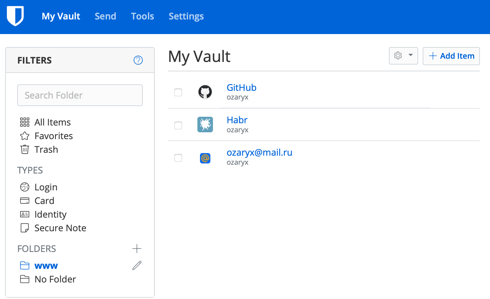
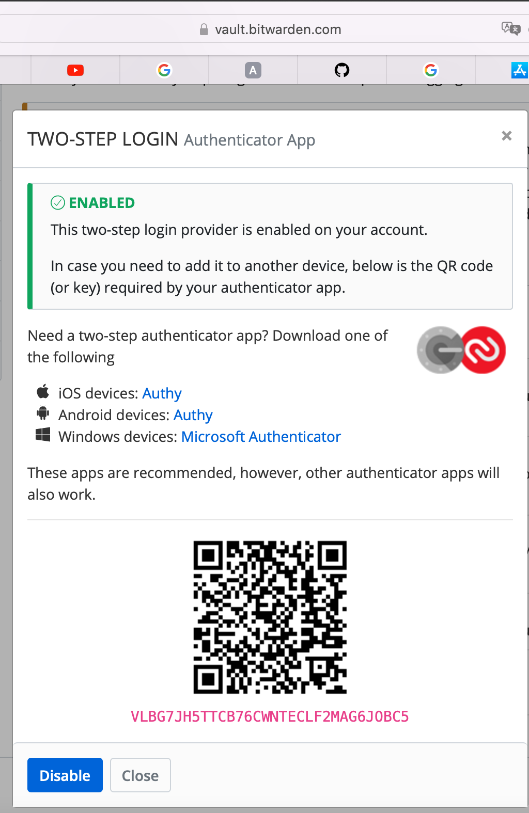
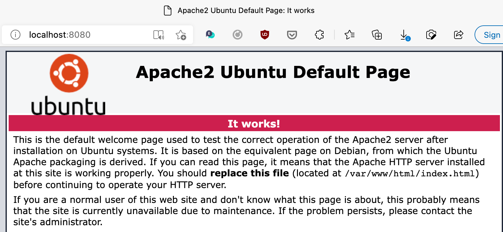
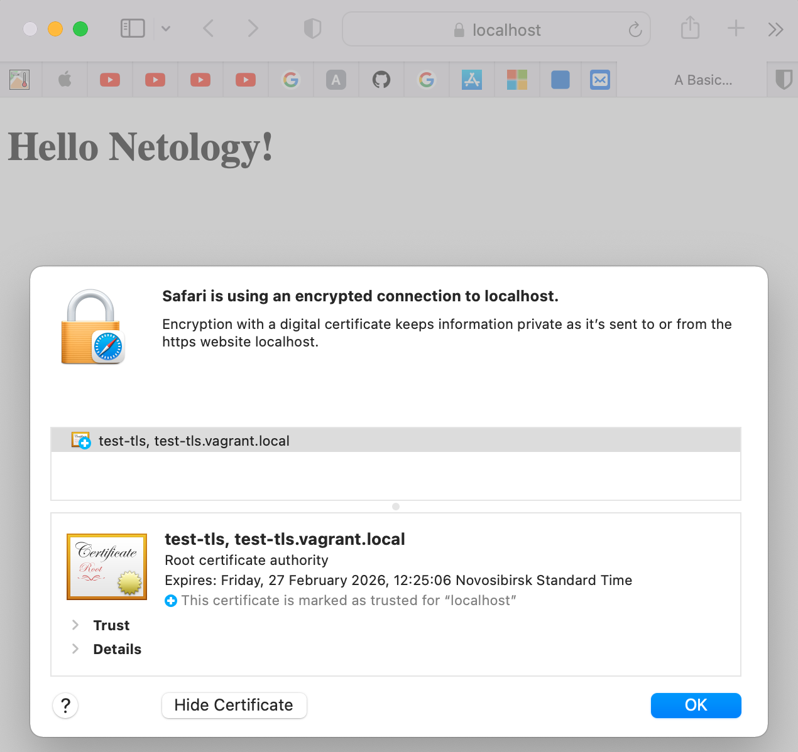
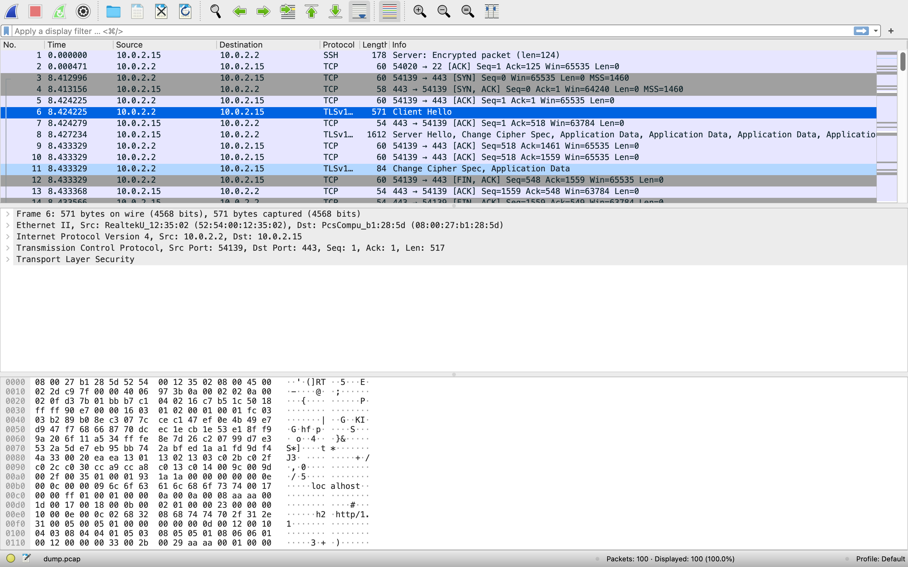

# Домашнее задание к занятию "3.9. Элементы безопасности информационных систем"

## Задание 1.
Установите Bitwarden плагин для браузера. Зарегистрируйтесь и сохраните несколько паролей.



## Задание 2.
Установите Google authenticator на мобильный телефон. Настройте вход в Bitwarden 
аккаунт через Google authenticator OTP.

Принципиально не пользуюсь Google authenticator (как и другими сервисами Гугл) из-за потенциальной возможности потери доступа к аккаунту гугл. А восстановить его будет практически невозможно или сильно сложно. Были прецеденты у знакомых. 

Настроил двухфакторную аутентификацию через Яндекс.Ключ



## Задание 3.
Установите apache2, сгенерируйте самоподписанный сертификат, настройте тестовый сайт для работы по HTTPS.

```shell
root@vagrant:/home/vagrant# apt install apache2
root@vagrant:/home/vagrant# systemctl list-units|grep apache
  apache2.service              loaded active running   The Apache HTTP Server
  
root@vagrant:/home/vagrant# ss -tlnp | grep apache
State   Recv-Q   Send-Q Local Address:Port      Peer Address:Port  Process
LISTEN  0  511     *:80         *:*        users:(("apache2",pid=4232,fd=4),("apache2",pid=4231,fd=4),("apache2",pid=4230,fd=4))                       

```

Включение, настройка HTTPS

```shell
root@vagrant:/home/vagrant# cd /etc/apache2/
root@vagrant:/etc/apache2# mkdir certs
root@vagrant:/etc/apache2# cd certs
root@vagrant:/etc/apache2/certs# openssl req -new -x509 -days 1461 -nodes -out cert.pem -keyout cert.key -subj "/C=RU/ST=Nsk/L=Nsk/O=Global Security/OU=DevOps/CN=test-tls.vagrant.local/CN=test-tls"
Generating a RSA private key
.................+++++
...........+++++
writing new private key to 'cert.key'
-----
root@vagrant:/etc/apache2/certs# ls -l
total 8
-rw------- 1 root root 1704 Feb 27 05:25 cert.key
-rw-r--r-- 1 root root 1432 Feb 27 05:25 cert.pem
```

```shell
root@vagrant:/etc/apache2/certs# a2enmod ssl
Considering dependency setenvif for ssl:
Module setenvif already enabled
Considering dependency mime for ssl:
Module mime already enabled
Considering dependency socache_shmcb for ssl:
Enabling module socache_shmcb.
Enabling module ssl.
See /usr/share/doc/apache2/README.Debian.gz on how to configure SSL and create self-signed certificates.
To activate the new configuration, you need to run:
  systemctl restart apache2
root@vagrant:/etc/apache2/certs# systemctl restart apache2
```
```shell
root@vagrant:/etc/apache2/certs# ss -tlnp | grep apache
LISTEN 0  511   *:443       *:*        users:(("apache2",pid=17123,fd=6),("apache2",pid=17122,fd=6),("apache2",pid=17121,fd=6))
LISTEN 0  511   *:80        *:*        users:(("apache2",pid=17123,fd=4),("apache2",pid=17122,fd=4),("apache2",pid=17121,fd=4))
```

Vagrantfile
```shell
...
  config.vm.network "forwarded_port", guest: 80, host:8080
  config.vm.network "forwarded_port", guest: 443, host:8443
...
```
```shell
macbook0P0LYWK:ubunta kmankov$ vagrant halt; vagrant up
==> default: Attempting graceful shutdown of VM...
Bringing machine 'default' up with 'virtualbox' provider...
==> default: Checking if box 'bento/ubuntu-20.04' version '202112.19.0' is up to date...
==> default: Clearing any previously set forwarded ports...
==> default: Clearing any previously set network interfaces...
==> default: Preparing network interfaces based on configuration...
    default: Adapter 1: nat
==> default: Forwarding ports...
    default: 19999 (guest) => 19999 (host) (adapter 1)
    default: 9100 (guest) => 9100 (host) (adapter 1)
    default: 80 (guest) => 8080 (host) (adapter 1)
    default: 443 (guest) => 8443 (host) (adapter 1)
    default: 22 (guest) => 2222 (host) (adapter 1)
...
```

```shell
root@vagrant:/etc/apache2# cat sites-enabled/001-site.conf
<VirtualHost *:443>
    ServerName site.ru
    DocumentRoot /var/www/apache/data
    SSLEngine on
    SSLCertificateFile certs/cert.pem
    SSLCertificateKeyFile certs/cert.key
    #SSLCertificateChainFile ssl/cert.ca-bundle
</VirtualHost>
```
```shell
root@vagrant:/etc/apache2# cat /var/www/apache/data/index.html
<!doctype html>
<html lang="en">
<head>
  <meta charset="utf-8">
  <meta name="viewport" content="width=device-width, initial-scale=1">

  <title>A Basic HTML5 Page</title>
  <meta name="description" content="A simple HTML5 page">
  <meta name="author" content="K.Mankov">
</head>

<body>
	<h1> Hello Netology! </h1>
</body>
</html>
```


## Задание 4.
Проверьте на TLS уязвимости произвольный сайт в интернете 
(кроме сайтов МВД, ФСБ, МинОбр, НацБанк, РосКосмос, РосАтом, РосНАНО и любых госкомпаний, 
объектов КИИ, ВПК ... и тому подобное).

```shell
root@vagrant:~/testssl.sh# ./testssl.sh -e --fast --parallel https://ya.ru
...
 Using "OpenSSL 1.0.2-chacha (1.0.2k-dev)" [~183 ciphers]
 on vagrant:./bin/openssl.Linux.x86_64
 (built: "Jan 18 17:12:17 2019", platform: "linux-x86_64")

 Start 2022-02-27 06:15:13        -->> 87.250.250.242:443 (ya.ru) <<--

 Further IP addresses:   2a02:6b8::2:242 
 rDNS (87.250.250.242):  ya.ru.
 Service detected:       HTTP

 Testing all 183 locally available ciphers against the server, ordered by encryption strength 

Hexcode  Cipher Suite Name (OpenSSL)       KeyExch.   Encryption  Bits     Cipher Suite Name (IANA/RFC)
-----------------------------------------------------------------------------------------------------------------------------
 xc030   ECDHE-RSA-AES256-GCM-SHA384       ECDH 256   AESGCM      256      TLS_ECDHE_RSA_WITH_AES_256_GCM_SHA384              
 xc02c   ECDHE-ECDSA-AES256-GCM-SHA384     ECDH 256   AESGCM      256      TLS_ECDHE_ECDSA_WITH_AES_256_GCM_SHA384            
 xc02f   ECDHE-RSA-AES128-GCM-SHA256       ECDH 256   AESGCM      128      TLS_ECDHE_RSA_WITH_AES_128_GCM_SHA256              
 xc02b   ECDHE-ECDSA-AES128-GCM-SHA256     ECDH 256   AESGCM      128      TLS_ECDHE_ECDSA_WITH_AES_128_GCM_SHA256            
 xc027   ECDHE-RSA-AES128-SHA256           ECDH 256   AES         128      TLS_ECDHE_RSA_WITH_AES_128_CBC_SHA256              
 xc023   ECDHE-ECDSA-AES128-SHA256         ECDH 256   AES         128      TLS_ECDHE_ECDSA_WITH_AES_128_CBC_SHA256            
 xc013   ECDHE-RSA-AES128-SHA              ECDH 256   AES         128      TLS_ECDHE_RSA_WITH_AES_128_CBC_SHA                 
 x9c     AES128-GCM-SHA256                 RSA        AESGCM      128      TLS_RSA_WITH_AES_128_GCM_SHA256                    
 x3c     AES128-SHA256                     RSA        AES         128      TLS_RSA_WITH_AES_128_CBC_SHA256                    
 x2f     AES128-SHA                        RSA        AES         128      TLS_RSA_WITH_AES_128_CBC_SHA                       
 x0a     DES-CBC3-SHA                      RSA        3DES        168      TLS_RSA_WITH_3DES_EDE_CBC_SHA                      

 Done 2022-02-27 06:15:21 [  10s] -->> 87.250.250.242:443 (ya.ru) <<--
```
```shell
root@vagrant:~/testssl.sh# ./testssl.sh -U --sneaky https://www.hackthissite.org/
 Using "OpenSSL 1.0.2-chacha (1.0.2k-dev)" [~183 ciphers]
 on vagrant:./bin/openssl.Linux.x86_64
 (built: "Jan 18 17:12:17 2019", platform: "linux-x86_64")

Testing all IPv4 addresses (port 443): 137.74.187.101 137.74.187.104 137.74.187.103 137.74.187.102 137.74.187.100
-----------------------------------------------------------------------------------------------------------
 Start 2022-02-27 06:23:18        -->> 137.74.187.101:443 (www.hackthissite.org) <<--

 Further IP addresses:   137.74.187.104 137.74.187.103 137.74.187.102 137.74.187.100 2001:41d0:8:ccd8:137:74:187:103 2001:41d0:8:ccd8:137:74:187:101
                         2001:41d0:8:ccd8:137:74:187:102 2001:41d0:8:ccd8:137:74:187:100 2001:41d0:8:ccd8:137:74:187:104 
 rDNS (137.74.187.101):  hackthissite.org.
 Service detected:       HTTP

 Testing vulnerabilities 

 Heartbleed (CVE-2014-0160)                not vulnerable (OK)
 CCS (CVE-2014-0224)                       not vulnerable (OK)
 Ticketbleed (CVE-2016-9244), experiment.  not vulnerable (OK)
 ROBOT                                     not vulnerable (OK)
 Secure Renegotiation (RFC 5746)           supported (OK)
 Secure Client-Initiated Renegotiation     not vulnerable (OK)
 CRIME, TLS (CVE-2012-4929)                not vulnerable (OK)
 BREACH (CVE-2013-3587)                    potentially NOT ok, "gzip" HTTP compression detected. - only supplied "/" tested
                                           Can be ignored for static pages or if no secrets in the page
 POODLE, SSL (CVE-2014-3566)               not vulnerable (OK)
 TLS_FALLBACK_SCSV (RFC 7507)              No fallback possible (OK), no protocol below TLS 1.2 offered
 SWEET32 (CVE-2016-2183, CVE-2016-6329)    not vulnerable (OK)
 FREAK (CVE-2015-0204)                     not vulnerable (OK)
 DROWN (CVE-2016-0800, CVE-2016-0703)      not vulnerable on this host and port (OK)
                                           make sure you don't use this certificate elsewhere with SSLv2 enabled services
                                           https://censys.io/ipv4?q=E8891DC1C226BA5F92ABDFA17D81B91099182F39B557BBDE4DFD381883D9F868 could help you to find out
 LOGJAM (CVE-2015-4000), experimental      not vulnerable (OK): no DH EXPORT ciphers, no DH key detected with <= TLS 1.2
 BEAST (CVE-2011-3389)                     not vulnerable (OK), no SSL3 or TLS1
 LUCKY13 (CVE-2013-0169), experimental     potentially VULNERABLE, uses cipher block chaining (CBC) ciphers with TLS. Check patches
 Winshock (CVE-2014-6321), experimental    not vulnerable (OK) - CAMELLIA or ECDHE_RSA GCM ciphers found
 RC4 (CVE-2013-2566, CVE-2015-2808)        no RC4 ciphers detected (OK)


 Done 2022-02-27 06:24:43 [  87s] -->> 137.74.187.101:443 (www.hackthissite.org) <<--
```
## Задание 5.
Установите на Ubuntu ssh сервер, сгенерируйте новый приватный ключ. 
Скопируйте свой публичный ключ на другой сервер. Подключитесь к серверу по SSH-ключу.

```shell
kmankov$ ssh-keygen -t rsa -b 4096 -f ~/.ssh/kmankov_rsa 
Generating public/private rsa key pair.
Enter passphrase (empty for no passphrase): 
Enter same passphrase again: 
Passphrases do not match.  Try again.
Enter passphrase (empty for no passphrase): 
Enter same passphrase again: 
Your identification has been saved in /Users/kmankov/.ssh/kmankov_rsa
Your public key has been saved in /Users/kmankov/.ssh/kmankov_rsa.pub
The key fingerprint is:
SHA256:1nodEWUQA75Mq3OcAsSzLGIykIFvcjlp57OACjBoPjI kmankov@macbook0P0LYWK.local
The key's randomart image is:
+---[RSA 4096]----+
|o         ..=+o  |
|.o   .   .   +   |
|+. o  +   o .    |
|*.O .o o + o .   |
|*Bo+. + S = .    |
|E*..o. o + o .   |
|+... o  = = .    |
|.   .    =       |
|                 |
+----[SHA256]-----+

kmankov$ ls -l ~/.ssh/
total 48
-rw-------  1 kmankov  staff  2675 Dec  6 21:21 id_rsa
-rw-r--r--  1 kmankov  staff   582 Dec  6 21:21 id_rsa.pub
-rw-------  1 kmankov  staff  3454 Mar  1 20:03 kmankov_rsa
-rw-r--r--  1 kmankov  staff   754 Mar  1 20:03 kmankov_rsa.pub
-rw-------  1 kmankov  staff  1707 Dec  6 22:21 known_hosts
-rw-------  1 kmankov  staff   748 Dec  6 22:08 known_hosts.old
```

```shell
kmankov$ ssh-copy-id -i ~/.ssh/kmankov_rsa -p 2222 vagrant@localhost
/usr/bin/ssh-copy-id: INFO: Source of key(s) to be installed: "/Users/kmankov/.ssh/kmankov_rsa.pub"
/usr/bin/ssh-copy-id: INFO: attempting to log in with the new key(s), to filter out any that are already installed
/usr/bin/ssh-copy-id: INFO: 1 key(s) remain to be installed -- if you are prompted now it is to install the new keys
vagrant@localhost's password: 

Number of key(s) added:        1

Now try logging into the machine, with:   "ssh -p '2222' 'vagrant@localhost'"
and check to make sure that only the key(s) you wanted were added.
```
```shell
kmankov$ ssh -i ~/.ssh/kmankov_rsa -p 2222 vagrant@localhost
Enter passphrase for key '/Users/kmankov/.ssh/kmankov_rsa': 
Welcome to Ubuntu 20.04.3 LTS (GNU/Linux 5.4.0-91-generic x86_64)

...
Last login: Tue Mar  1 13:19:30 2022 from 10.0.2.2

vagrant@vagrant:~$ cat ~/.ssh/authorized_keys 
ssh-rsa AAAAB3NzaC1yc2...6mLulosV4V vagrant
ssh-rsa AAAAB3NzaC1yc2...Ik6otvpw== kmankov@macbook.local
```

## Задание 6.
Переименуйте файлы ключей из задания 5. Настройте файл конфигурации SSH клиента, так 
чтобы вход на удаленный сервер осуществлялся по имени сервера.

```shell
kmankov$ cat ~/.ssh/config
Host localhost
  Port 2222
  User vagrant
  IdentityFile /Users/kmankov/.ssh/kmankov_rsa
```
```shell
kmankov$ ssh localhost
Enter passphrase for key '/Users/kmankov/.ssh/kmankov_rsa': 
Welcome to Ubuntu 20.04.3 LTS (GNU/Linux 5.4.0-91-generic x86_64)

Last login: Tue Mar  1 13:20:24 2022 from 10.0.2.2
```

## Задание 7.
Соберите дамп трафика утилитой tcpdump в формате pcap, 100 пакетов. Откройте файл pcap в Wireshark.

```shell
root@vagrant:/home/vagrant# tcpdump -c 100 -w dump.pcap
tcpdump: listening on eth0, link-type EN10MB (Ethernet), capture size 262144 bytes
100 packets captured
108 packets received by filter
0 packets dropped by kernel

```


 ---
## Задание для самостоятельной отработки (необязательно к выполнению)

8*. Просканируйте хост scanme.nmap.org. Какие сервисы запущены?

```shell
root@vagrant:/home/vagrant# nmap -A -T4 scanme.nmap.org
Starting Nmap 7.80 ( https://nmap.org ) at 2022-03-03 15:23 UTC
Nmap scan report for scanme.nmap.org (45.33.32.156)
Host is up (0.051s latency).
Other addresses for scanme.nmap.org (not scanned): 2600:3c01::f03c:91ff:fe18:bb2f
Not shown: 995 closed ports
PORT      STATE SERVICE    VERSION
22/tcp    open  ssh        OpenSSH 6.6.1p1 Ubuntu 2ubuntu2.13 (Ubuntu Linux; protocol 2.0)
| ssh-hostkey: 
|   1024 ac:00:a0:1a:82:ff:cc:55:99:dc:67:2b:34:97:6b:75 (DSA)
|   2048 20:3d:2d:44:62:2a:b0:5a:9d:b5:b3:05:14:c2:a6:b2 (RSA)
|   256 96:02:bb:5e:57:54:1c:4e:45:2f:56:4c:4a:24:b2:57 (ECDSA)
|_  256 33:fa:91:0f:e0:e1:7b:1f:6d:05:a2:b0:f1:54:41:56 (ED25519)
53/tcp    open  domain?
80/tcp    open  http       Apache httpd 2.4.7 ((Ubuntu))
|_http-server-header: Apache/2.4.7 (Ubuntu)
|_http-title: Go ahead and ScanMe!
9929/tcp  open  nping-echo Nping echo
31337/tcp open  tcpwrapped
Device type: general purpose
Running: QEMU
OS CPE: cpe:/a:qemu:qemu
OS details: QEMU user mode network gateway
Network Distance: 2 hops
Service Info: OS: Linux; CPE: cpe:/o:linux:linux_kernel

TRACEROUTE (using port 80/tcp)
HOP RTT     ADDRESS
1   0.15 ms _gateway (10.0.2.2)
2   0.39 ms scanme.nmap.org (45.33.32.156)

OS and Service detection performed. Please report any incorrect results at https://nmap.org/submit/ .
Nmap done: 1 IP address (1 host up) scanned in 176.03 seconds
```

9*. Установите и настройте фаервол ufw на web-сервер из задания 3. Откройте доступ снаружи только к портам 22,80,443

```shell
root@vagrant:/home/vagrant# ufw status
Status: inactive

root@vagrant:/home/vagrant# ufw allow 22
Rules updated
Rules updated (v6)

root@vagrant:/home/vagrant# ufw allow 80
Rules updated
Rules updated (v6)

root@vagrant:/home/vagrant# ufw allow 443
Rules updated
Rules updated (v6)

root@vagrant:/home/vagrant# ufw enable
Command may disrupt existing ssh connections. Proceed with operation (y|n)? y
Firewall is active and enabled on system startup

root@vagrant:/home/vagrant# ufw status
Status: active

To                         Action      From
--                         ------      ----
22                         ALLOW       Anywhere                  
80                         ALLOW       Anywhere                  
443                        ALLOW       Anywhere                  
22 (v6)                    ALLOW       Anywhere (v6)             
80 (v6)                    ALLOW       Anywhere (v6)             
443 (v6)                   ALLOW       Anywhere (v6)             
```

 ---

## Как сдавать задания

Обязательными к выполнению являются задачи без указания звездочки. Их выполнение необходимо для получения зачета и диплома о профессиональной переподготовке.

Задачи со звездочкой (*) являются дополнительными задачами и/или задачами повышенной сложности. Они не являются обязательными к выполнению, но помогут вам глубже понять тему.

Домашнее задание выполните в файле readme.md в github репозитории. В личном кабинете отправьте на проверку ссылку на .md-файл в вашем репозитории.

Также вы можете выполнить задание в [Google Docs](https://docs.google.com/document/u/0/?tgif=d) и отправить в личном кабинете на проверку ссылку на ваш документ.
Название файла Google Docs должно содержать номер лекции и фамилию студента. Пример названия: "1.1. Введение в DevOps — Сусанна Алиева".

Если необходимо прикрепить дополнительные ссылки, просто добавьте их в свой Google Docs.

Перед тем как выслать ссылку, убедитесь, что ее содержимое не является приватным (открыто на комментирование всем, у кого есть ссылка), иначе преподаватель не сможет проверить работу. Чтобы это проверить, откройте ссылку в браузере в режиме инкогнито.

[Как предоставить доступ к файлам и папкам на Google Диске](https://support.google.com/docs/answer/2494822?hl=ru&co=GENIE.Platform%3DDesktop)

[Как запустить chrome в режиме инкогнито ](https://support.google.com/chrome/answer/95464?co=GENIE.Platform%3DDesktop&hl=ru)

[Как запустить  Safari в режиме инкогнито ](https://support.apple.com/ru-ru/guide/safari/ibrw1069/mac)

Любые вопросы по решению задач задавайте в чате учебной группы.

---

